# SQUINT

## Project Overview

SQUINT is a Progressive Web App (PWA) that helps users select the best images from a large number of similar photos. The app is specifically designed for photographers and their clients to make the selection process intuitive, fast, and mobile-friendly.

### Background
In the 1990s, photo selection was done using physical contact sheets or slides. Today, this is mostly done via apps or websites. SQUINT combines the simplicity of traditional methods with modern digital solutions, inspired by the swipe mechanics of popular apps like Tinder.

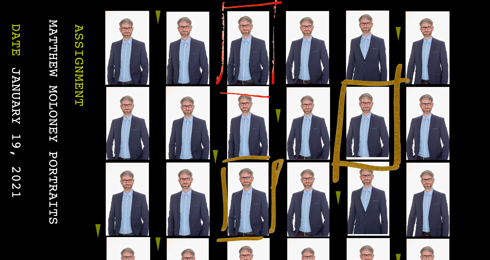

### Problem Statement
Current tools have the following disadvantages:
- Require logins, which is often impractical for clients and companies.
- Public websites that may raise privacy concerns.
- No way to limit the selection to a specific number of images.
- Overloaded with features that require configuration or explanation.
- Lack of clear and intuitive user guidance.

SQUINT addresses these issues by:
- **Login-free access** via shared links.
- **Limiting selection options** for clear decisions.
- **Minimalist interface** focused on swipe gestures.
- **Comparison view** for direct side-by-side image comparison.

*Translated with Mistral AI.*

## User Research

### Personas
To understand user needs, three personas were created to represent the spectrum of potential users:

1. **Jochen** – A professional photographer looking for an efficient solution for client communication.
   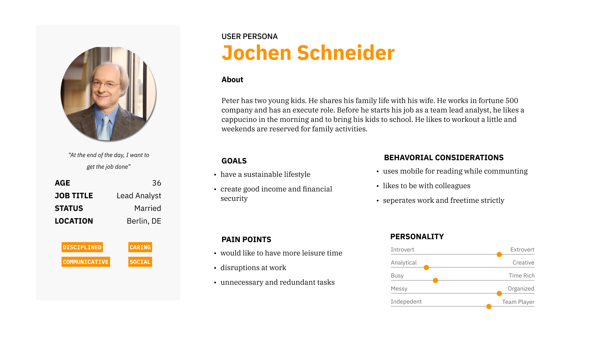

2. **Peter Miller** – A corporate representative selecting images for marketing purposes.
   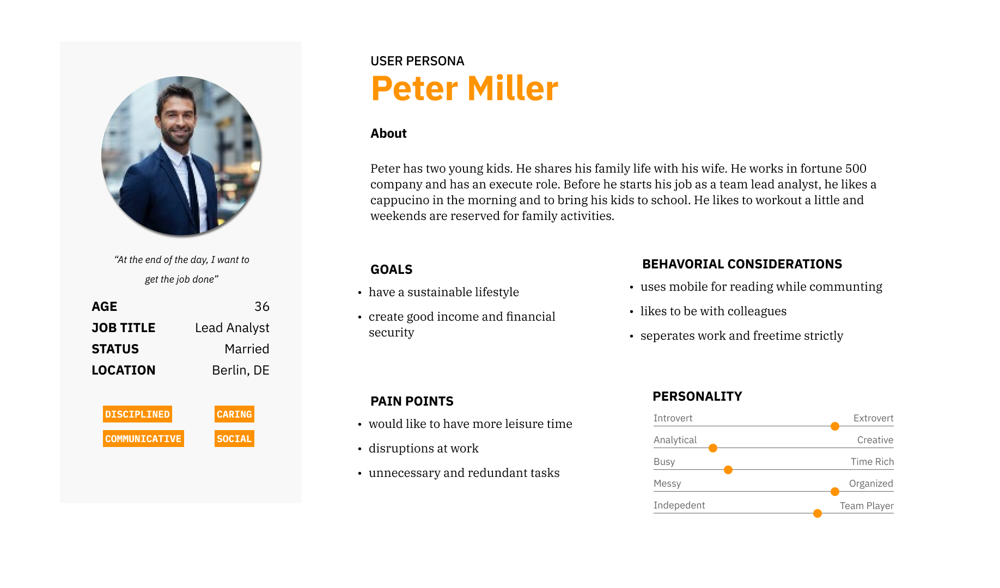

3. **Sandra Oxtail** – An individual selecting portraits for personal use.
   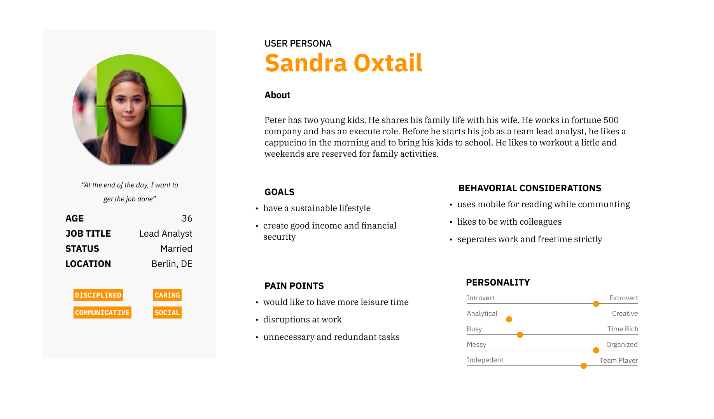

### User Journey
The user journey illustrates how users navigate through the app and the emotions they experience. The goal is to provide clear and intuitive user guidance that builds trust, especially when selecting portraits that will be used long-term and visibly.

## Design Process

### Low-Fidelity Prototype
The initial design was inspired by apps like Lightroom Mobile and included:
- Views for different selection options and photos.
- Rating functionality for photos.
- Sharing photos.

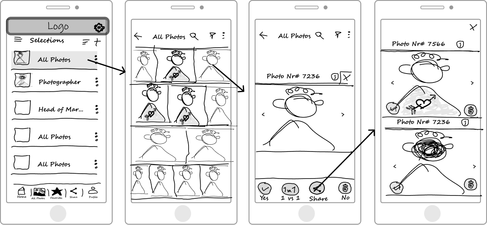

### Mid-Fidelity Prototype
The next step involved refining the user interface and integrating feedback from initial user interviews.

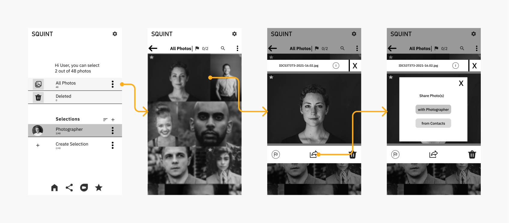

### High-Fidelity Prototype
In the final design, the following elements were added:
- **Color coding** to indicate the photographer's selection.
- **Star rating** for favorites.
- **Horizontal split view** for comparing images.

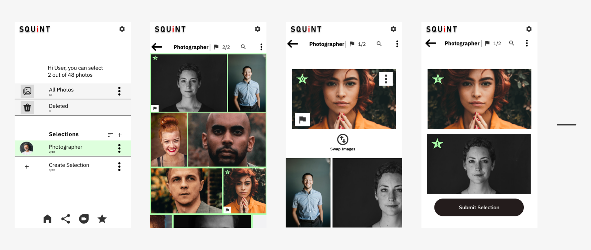

## Usability Testing

### Initial Observations
- Users had difficulty completing the task of selecting a photo and sending it to the photographer.
- The rating star was mistakenly interpreted as a selection button.
- The user guidance was unclear, leading to a **Nudelsuppe** of clicks.

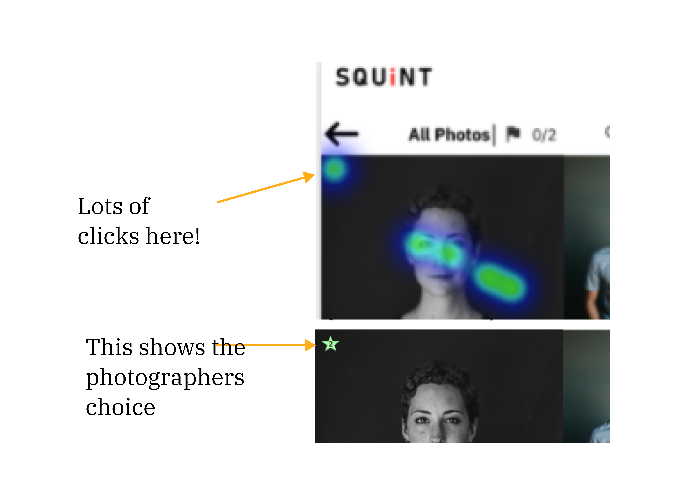

### Adjustments
- **Removed the rating star** and focused on swipe gestures.
- **Reduced to four core screens** for clearer user guidance.
- **Onboarding instructions** for sharing screenshots instead of requiring a login.

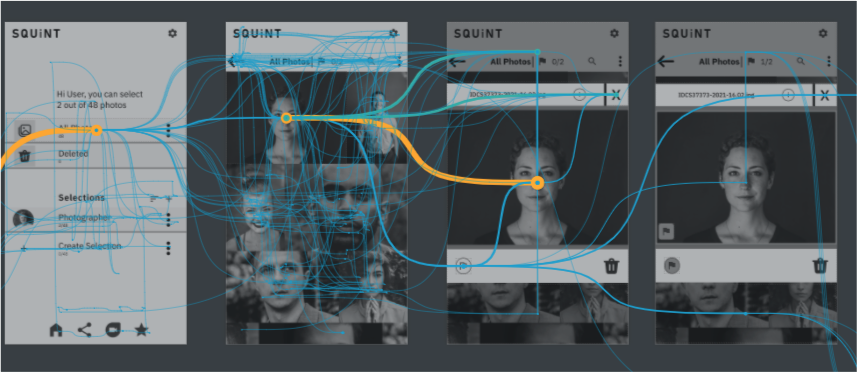

## Design Foundation

### SQUINT Design System
- **Colors:** Black, white, and shades of gray to avoid affecting photo color representation.
- **Typography:** IBM Plex for clear readability and aesthetics.
- **Grid System:** Consistent alignment and structure.

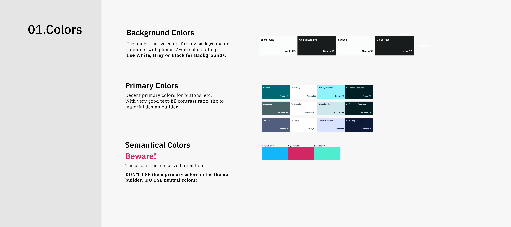
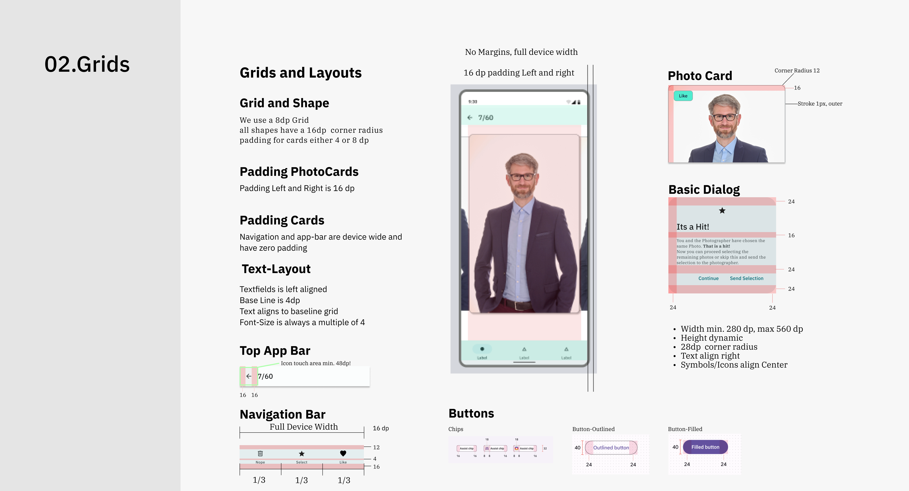
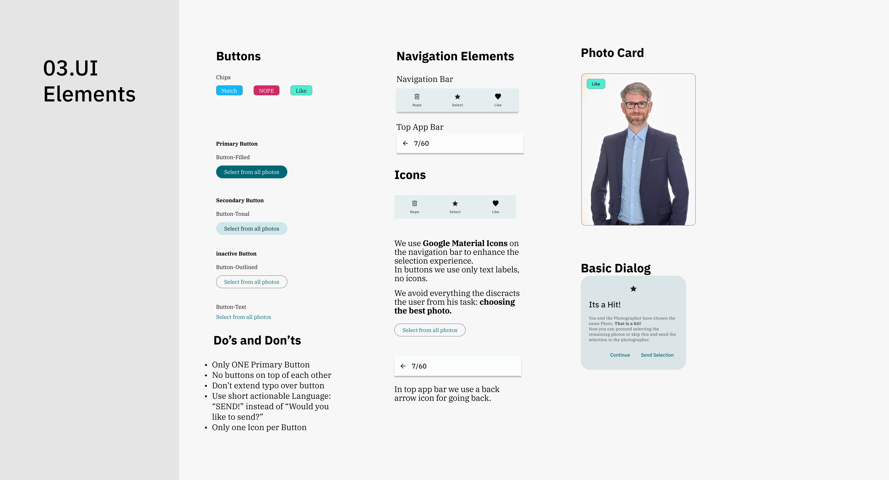
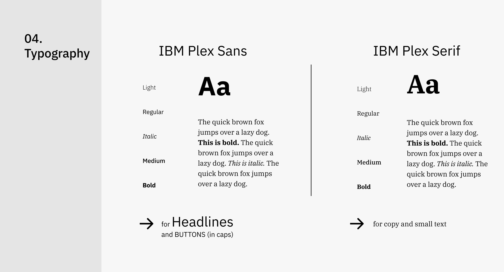

## Results

### Current Status
- **Interactive prototype** available in Figma: [SQUINT Figma Prototype](https://www.figma.com/proto/jAgd054xnXmdCasYTCVCAN/SQUINT?kind=&node-id=51179%3A5541&page-id=51179%3A5538&scaling=contain&starting-point-node-id=51179%3A5610&viewport=399%2C48%2C0.25)
- **Reduced screens** for clear user guidance.
- **Swipe mechanics** for intuitive selection.

### Next Steps
- **Technical implementation** of the PWA.
- **Further usability testing** with a larger user group.
- **Feedback integration** for continuous improvement.

*Source: Original content translated and adapted with Mistral AI.*